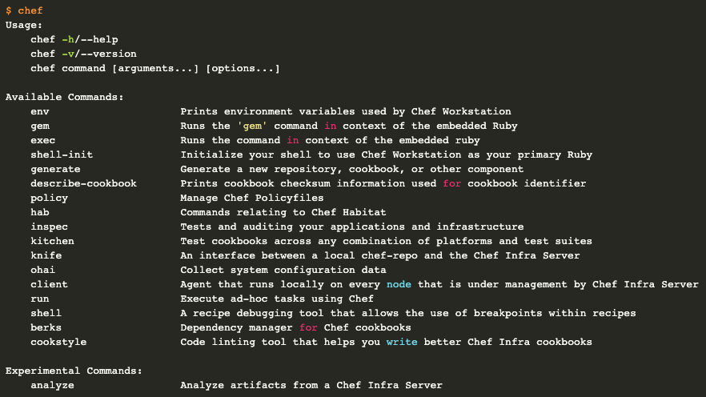

# Chef CLI (Catalog)

Throughout the history of Chef, we have created and acquired a variety
of tools that have grown to a point that, as a Chef Operator, it is
hard to know, discover and understand all of them. A few of the tools
that our users use (almost) every day are:

* chef (CLI that includes Policyfiles management)
* hab (Habitat CLI)
* inspec
* ohai
* kitchen (Test-kitchen)
* knife
* berks (Berkshelf)
* cookstyle
* delivery
* chef-client
* chef-run/chef-apply
* chef-shell
* chef-solo

Currently, inside the latest version of Chef Workstation (and since version `0.10.41`),
the team has implemented a top-level `chef` command that acts as a wrapper around chef
commands. In this design proposal we expand this scope to be a proxy/catalog of all the
user facing cli tools we package inside Chef Workstation.

Quick diagram that illustrates the new Chef CLI Catalog:

With this architecture, we would be able to integrate and modularize multiple tools
in a single place and make the chef command a first-class citizen of our development
experience. We will also be able to gather immediate information from our users of
all our tools so we can understand what parts of our tooling are the most used and
which areas can we improve.

Once detecting such areas of improvement, we can have the flexibility to improve
tools entirely or sub-sections of the tool. Say for instance, that our users run
`knife search` around 30-50 times a day, if the command takes around 10-15
seconds to run, we are consuming ~10 minutes a day from our users waiting for value.
With this approach we could rewrite that specific command to run 10x faster and
give that time back to our users.

[Gist with a few mocked help commands.](https://gist.github.com/afiune/1dc854089002e182288a0452eaa91908)

## Goals
* Have a single, unified way to discover tools to interact with Chef products
* A path to have consistent/usable performance on all supported platforms
* Gather data about how our users consume and interact with our tools (Telemetry)
* Agreement to a common UX standards of our (CLI) tools
* Have the flexibility to rename tools and commands within our ecosystem
* Enable developers to develop tools in any supported programming languages at Chef

## Motivation

    As a Chef Operator,
    I need a unified Command Line Interface (CLI) that lets me interact with every Chef product,
    so I can easly discover the capabilities of the Chef ecosystem.

    As a Chef Developer,
    I need to be able to gather information about how our users consume and interact with our tools,
    so I can identify which commands are used the most and measure the usability and performance on all supported platforms.

## Specification

Implementation Questions:
* What is the strategy to route existing binaries to the top-level `chef` command?
* Are we discouraging the use of individual sub-binaries like `knife` or `chef-run`?
* What happens when a user runs a sub-binary without the prefix `chef`?
* How are we communicating deprecations? (UX)
* How are we communicating reorganization of sub-commands? (UX)

## Downstream Impact
Re organization of Policyfiles commands inside the chef-cli.

## Milestones
### Implement Telemetry into the top-level chef command

To start gathering information from the to-level chef command we need to create
a telemetry Go library.

The implementation details of Telemetry will be done on a separate document.

### Refactor the Chef-CLI
Restructure the chef-cli binary to have a better sub-command organization,
things that are global to the CLI tool like, `chef generate` or `chef shell-init`
should stay in the binary but we should extract the Policyfile logic out into
its own binary.

### Link tools and binaries to the top-level chef command
Make the top-level chef command to understand all our tools and binaries, that
is, to be able to route sub-commands like chef hab to the hab CLI, and chef
inspec to the inspec CLI.
